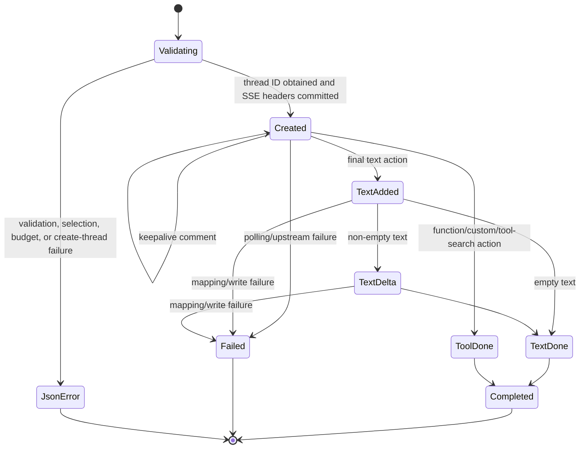

# Responses SSE event-order contract

This document is normative for `POST /v1/responses` when `stream` is omitted or is not the literal JSON value `false`.

## Framing

Each named event is encoded as one SSE block:

```text
event: <event.type>
data: <one-line JSON serialization of the complete event>

```

The `event:` value MUST equal the JSON object's `type`. The server MAY emit comment blocks of the form `: hyperagent-running` while the HyperAgent thread is being polled. Comments carry no state and clients MUST ignore them.

The response headers are committed only after HyperAgent returns a thread ID. The response is HTTP 200 with `Content-Type: text/event-stream; charset=utf-8`, `Cache-Control: no-cache, no-transform`, and `X-Hyperagent-Thread-Id`.

## State machine



`Completed` and `Failed` are terminal. A connected client MUST receive at most one terminal event. A disconnected client may receive no terminal event.

## Common invariants

- The first data event MUST be `response.created`.
- `response.created.response.status` MUST be `in_progress`.
- All response-bearing events in one stream MUST use the same `response.id` and requested `model`.
- `metadata.hyperagent_thread_id` MUST equal the response header.
- `metadata.request_id` MUST equal the originating dispatch request ID; a completed idempotency replay retains it.
- `metadata.usage_source` MUST be `unavailable` and `usage` MUST be omitted.
- A successful stream MUST end with `response.completed`.
- A failed stream after headers MUST end with `response.failed` and MUST NOT also emit `response.completed`.
- No event in this profile is required to contain `sequence_number`, `output_index`, or `content_index`.
- The adapter emits completed HyperAgent output as one text delta; this is SSE framing, not native token streaming.

## Exact successful sequences

### Final text, non-empty

1. `response.created`
2. zero or more keepalive comments
3. `response.output_item.added`
4. `response.output_text.delta`
5. `response.output_item.done`
6. `response.completed`

The added item is an assistant message with an empty `content` array. The delta contains the entire final text. The done item contains one `output_text` part with that same complete text.

### Final text, empty

1. `response.created`
2. zero or more keepalive comments
3. `response.output_item.added`
4. `response.output_item.done`
5. `response.completed`

### Function call

1. `response.created`
2. zero or more keepalive comments
3. `response.output_item.done` with `item.type = "function_call"`
4. `response.completed`

The item contains `call_id`, `name`, and JSON-string `arguments`.

### Custom tool call

1. `response.created`
2. zero or more keepalive comments
3. `response.output_item.done` with `item.type = "custom_tool_call"`
4. `response.completed`

The item contains `call_id`, `name`, and raw string `input`.

### Client tool search

1. `response.created`
2. zero or more keepalive comments
3. `response.output_item.done` with `item.type = "tool_search_call"`
4. `response.completed`

The item has `execution = "client"` and `status = "completed"`.

## Failure sequence

When polling or mapping fails after `response.created`:

1. `response.created`
2. zero or more keepalive comments
3. `response.failed`

The failed response has `status = "failed"`, an empty output array, and an error with type `server_error`. Unclassified failures use `hyperagent_bridge_error`; hard upstream timeouts use `upstream_timeout`. The HTTP status remains 200 because headers were already sent.

The error message is adapter-owned and sanitized. It MUST NOT include an upstream body, exception message, prompt, output, credential, or raw agent/thread/reservation identifier.

## Unsupported incomplete state

`response.incomplete` and `status = incomplete` are outside this profile and MUST NOT be emitted. Success terminates with `response.completed`; post-header failure terminates with `response.failed`; peer disconnect may prevent delivery of either terminal event.
